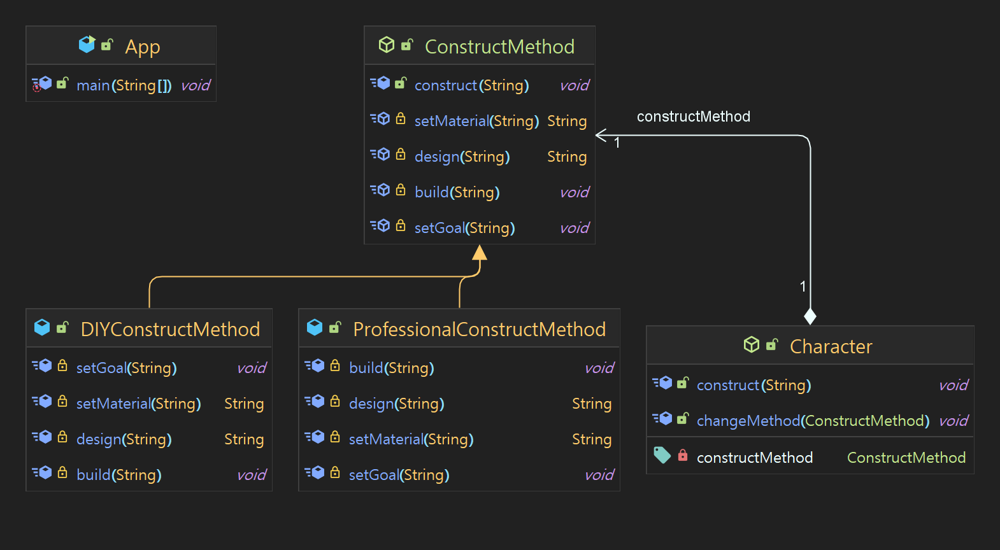

# 템플릿 메서드

## 의도

---
> 복잡한 작업을 코드로 구현할때, 알고리즘의 골격을 먼저 정의하고 구현 과정을
> 서브 클래스로 미룹니다. 템플릿 메서드를 사용하면 서브클래스에서 알고리즘의
> 구조를 변경하지 않고도 알고리즘의 구현을 변경 할 수 있습니다.

## 설명

---
실제 적용
> 건물을 건축하는 일반적인 단계는 동일합니다. 먼저 목표를 설정하고, 재료를 선택하고,
> 건물을 설계하고, 마지막으로 건물을 건축합니다. 그러나 이러한 단계를 실제로 구현하는 방법은
> 여러가지가 있습니다.

일반적으로

> 템플릿 메서드 패턴은 부모 클래스에서 일반적인 단계를 정의하고, 
> 서브클래스에서 세부적인 방법을 구현 하도록 합니다.

위키피디아

> In object-oriented programming, the template method is one of the behavioral design patterns
> identified by Gamma et al. in the book Design Patterns. The template method is a method in a
> superclass, usually an abstract superclass, and defines the skeleton of an operation in terms of
> a number of high-level steps. These steps are themselves implemented by additional helper methods
> in the same class as the template method.

**클래스 다이어그램**

